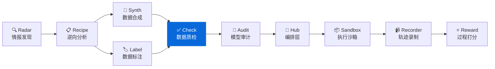

<div align="center">

# DataCheck

**数据质检工具 — 自动化质量检查、异常检测、分布分析**
**Automated quality checks, anomaly detection & distribution analysis for LLM datasets**

[](https://pypi.org/project/knowlyr-datacheck/)
[](https://www.python.org/downloads/)
[](LICENSE)
[](#mcp-server)

[快速开始](#快速开始) · [质量规则](#质量规则) · [Schema 推断](#schema-推断--schema-inference) · [数据修复](#数据修复--data-fix) · [报告对比](#报告对比--report-diff) · [LLM 智能检查](#llm-智能检查--llm-quality-check) · [MCP Server](#mcp-server) · [生态](#data-pipeline-生态)

</div>

---

**GitHub Topics**: `data-quality`, `anomaly-detection`, `data-validation`, `mcp`, `ai-data-pipeline`

自动化数据质量检查，支持规则验证、重复检测、分布分析，生成可读的质量报告。

## 核心能力 / Core Capabilities

```
数据文件 + Schema → 规则检查 → 异常检测 → 分布分析 → 质量报告
```

### 质量仪表盘预览 / Sample Dashboard

| 通过率 | 评级 | 错误 | 警告 | 重复 |
|:------:|:----:|:----:|:----:|:----:|
| **92%** | 🟢 优秀 | 8 条 | 3 条 | 2 组 |

### 检查项目 / Checks

| 检查类型 | 说明 |
|----------|------|
| 🔴 **必填字段** | 检查是否包含所有必填字段 |
| 🔴 **非空检查** | 检查关键字段是否为空 |
| 🔴 **格式检查** | 检查数据类型是否正确 |
| 🟡 **长度边界** | 检查文本长度是否合理 |
| 🟡 **重复检测** | 检测完全重复 + 近似重复 (n-gram Jaccard) |
| 🟡 **隐私信息 (PII)** | 检测邮箱、手机号、身份证号 |
| 🟡 **乱码检测** | 检测乱码、异常字符、编码错误 |
| 🟡 **重复文本** | 检测文本内过度重复内容 |
| 🔵 **语言一致性** | 检查文本语言是否一致 (中/英/日/韩/俄/阿拉伯/泰) |
| 🔵 **LLM 质量评估** | 使用 LLM 评估指令清晰度、回复相关性 |

### 质量评级 / Rating

| 通过率 | 评级 | 建议 |
|--------|------|------|
| ≥90% | 🟢 优秀 | 可直接使用 |
| ≥70% | 🟡 良好 | 建议修复警告 |
| ≥50% | 🟠 一般 | 需要处理错误 |
| <50% | 🔴 需改进 | 严重质量问题 |

## 安装 / Installation

```bash
pip install knowlyr-datacheck
```

可选依赖：

```bash
pip install knowlyr-datacheck[stats]    # 统计分析 (numpy, scipy)
pip install knowlyr-datacheck[mcp]      # MCP 服务器
pip install knowlyr-datacheck[llm]      # LLM 智能检查 (Anthropic/OpenAI)
pip install knowlyr-datacheck[yaml]     # YAML 规则配置
pip install knowlyr-datacheck[all]      # 全部功能
```

## 快速开始 / Quick Start

### 检查数据文件 / CLI

```bash
# 基础检查 (支持 JSON / JSONL / CSV)
knowlyr-datacheck check data.json
knowlyr-datacheck check data.jsonl
knowlyr-datacheck check data.csv

# 指定 Schema
knowlyr-datacheck check data.json -s schema.json

# 输出报告 (Markdown / JSON / HTML)
knowlyr-datacheck check data.json -o report.md
knowlyr-datacheck check data.json -o report.html -f html
knowlyr-datacheck check data.json -o report.json -f json

# 采样检查 (大数据集，自动显示进度条)
knowlyr-datacheck check data.jsonl --sample 1000
knowlyr-datacheck check data.jsonl --sample-rate 0.1

# CI 集成: 自定义阈值
knowlyr-datacheck check data.json --threshold 0.9
knowlyr-datacheck check data.json --strict

# Schema 推断
knowlyr-datacheck infer data.jsonl -o schema.json

# 数据修复 (去重 / 去空白 / PII 脱敏)
knowlyr-datacheck fix data.jsonl -o fixed.jsonl
knowlyr-datacheck fix data.jsonl -o fixed.jsonl --strip-pii

# 报告对比 (两次质检报告 diff)
knowlyr-datacheck diff report_v1.json report_v2.json

# LLM 智能检查 (需要 API Key)
knowlyr-datacheck check data.json --ruleset llm
knowlyr-datacheck check data.json --ruleset llm --llm-provider openai
```

### 在 Python 中接入 / Python SDK

```python
from datacheck import DataChecker, QualityReport

checker = DataChecker()
result = checker.check_file("data.json", schema_path="schema.json")

report = QualityReport(result)
report.print_summary()
report.save("./report.md")
```

<details>
<summary>输出示例</summary>

```
正在检查 data.json...

==================================================
  数据质量检查结果
==================================================
  总样本: 100
  通过: 92
  失败: 8
  通过率: 92.0%
  评级: 🟢 优秀
==================================================

🟡 警告: 3
⚠️  重复: 2 组
```

</details>

### 使用 DataRecipe 分析结果验证 / Validate DataRecipe Outputs

```bash
# 验证合成数据
knowlyr-datacheck validate ./analysis_output/my_dataset/

# 验证指定文件
knowlyr-datacheck validate ./analysis_output/my_dataset/ -d custom_data.json
```

<details>
<summary>输出示例</summary>

```
正在验证 ./analysis_output/my_dataset/...
✓ 报告已保存: ./analysis_output/my_dataset/12_质检报告/quality_report.md

==================================================
  数据质量检查结果
==================================================
  总样本: 1000
  通过: 956
  失败: 44
  通过率: 95.6%
  评级: 🟢 优秀
==================================================
```

</details>

---

## 质量规则 / Quality Rules

### 内置规则 / Built-in Rules

```bash
# 查看所有规则
knowlyr-datacheck rules
```

| 规则 ID | 名称 | 级别 | 说明 |
|---------|------|------|------|
| `required_fields` | 必填字段检查 | 🔴 错误 | 检查必填字段是否存在 |
| `non_empty` | 非空检查 | 🔴 错误 | 检查关键字段是否为空 |
| `format_valid` | 格式检查 | 🔴 错误 | 检查数据类型是否正确 |
| `score_valid` | 评分有效性 | 🔴 错误 | 检查评分是否在有效范围 |
| `length_bounds` | 长度边界检查 | 🟡 警告 | 检查文本长度范围 |
| `pii_detection` | 隐私信息检测 | 🟡 警告 | 检测邮箱、手机号、身份证号 |
| `garbled_text` | 乱码检测 | 🟡 警告 | 检测乱码、异常字符 |
| `repetitive_text` | 重复文本检测 | 🟡 警告 | 检测文本内过度重复 |
| `language_consistency` | 语言一致性 | 🔵 提示 | 多语言检测 (中/英/日/韩/俄/阿拉伯/泰) |

### 预设规则集 / Rule Packs

```bash
# 使用 SFT 数据规则集
knowlyr-datacheck check data.json --ruleset sft

# 使用偏好数据规则集
knowlyr-datacheck check data.json --ruleset preference
```

| 规则集 | 说明 |
|--------|------|
| `default` | 通用规则 |
| `sft` | SFT 数据专用规则 (指令质量、回复质量) |
| `preference` | 偏好数据专用规则 (chosen/rejected 差异) |
| `llm` | LLM 质量评估 (需要 `knowlyr-datacheck[llm]`) |

### 自定义规则配置 / Custom Rules (YAML)

通过 YAML 配置文件定义自定义规则，无需写 Python 代码：

```yaml
# rules.yaml
rules:
  - field: instruction
    check: min_length
    value: 10
    severity: error

  - field: response
    check: max_length
    value: 10000
    severity: warning

  - field: category
    check: enum
    values: ["qa", "chat", "code", "math"]
    severity: error

  - field: instruction
    check: regex
    pattern: "^[A-Z\u4e00-\u9fff]"
    severity: info
    message: "指令应以大写字母或中文开头"
```

```bash
# 使用自定义规则
knowlyr-datacheck check data.json --rules-file rules.yaml
```

支持的检查类型：`required`、`non_empty`、`min_length`、`max_length`、`regex`、`enum`

> 需要安装 YAML 支持：`pip install knowlyr-datacheck[yaml]`

---

## Schema 推断 / Schema Inference

自动从数据文件推断字段类型、约束和必填项：

```bash
knowlyr-datacheck infer data.jsonl -o schema.json
```

<details>
<summary>输出示例</summary>

```json
{
  "sample_count": 1000,
  "fields": {
    "instruction": {
      "type": "string",
      "required": true,
      "min_length": 5,
      "max_length": 200,
      "avg_length": 68
    },
    "response": {
      "type": "string",
      "required": true,
      "min_length": 12,
      "max_length": 820,
      "avg_length": 251
    },
    "score": {
      "type": "integer",
      "required": true,
      "min_value": 1,
      "max_value": 5,
      "enum": [1, 2, 3, 4, 5]
    }
  }
}
```

</details>

---

## 数据修复 / Data Fix

自动修复常见数据质量问题：

```bash
# 基础修复 (去重 + 去空白 + 移除空样本)
knowlyr-datacheck fix data.jsonl -o fixed.jsonl

# 包含 PII 脱敏
knowlyr-datacheck fix data.jsonl -o fixed.jsonl --strip-pii

# 跳过特定修复
knowlyr-datacheck fix data.jsonl -o fixed.jsonl --no-dedup --no-trim
```

修复项目：

| 修复 | 说明 |
|------|------|
| **去重** | 移除完全重复样本（保留首条） |
| **去空白** | 去除字符串字段首尾空白 |
| **移除空样本** | 移除全空/全 null 样本 |
| **PII 脱敏** | 替换邮箱→`[EMAIL]`、手机→`[PHONE]`、身份证→`[ID]` |

---

## 分布分析 / Distribution Analysis

### 对比多个数据文件

```bash
knowlyr-datacheck compare seed.json synthetic.json -o comparison.md
```

<details>
<summary>输出示例</summary>

```markdown
# 数据分布对比报告

## 文件概要

| 文件 | 样本数 |
|------|--------|
| seed.json | 50 |
| synthetic.json | 1000 |

## 字段对比

### instruction
- **seed.json**: 长度 15-200 (平均 68)
- **synthetic.json**: 长度 12-198 (平均 72)

### response
- **seed.json**: 长度 50-800 (平均 245)
- **synthetic.json**: 长度 45-820 (平均 251)
```

</details>

### 分析内容

- **长度统计**: 最小值、最大值、平均值
- **唯一值比例**: 检测多样性
- **值分布**: 数值型字段的分布情况
- **参考对比**: 与种子数据的分布差异

---

## 报告对比 / Report Diff

对比两次质检报告，追踪数据质量变化：

```bash
# 对比两次 JSON 报告
knowlyr-datacheck diff report_v1.json report_v2.json

# 保存对比结果
knowlyr-datacheck diff report_v1.json report_v2.json -o diff.md
```

<details>
<summary>输出示例</summary>

```markdown
# 质量报告对比

| 指标 | 报告 A | 报告 B | 变化 |
|------|--------|--------|------|
| 通过率 | 90.0% | 95.0% | ↑ +5.0pp |
| 错误数 | 5 | 2 | ↓ -3 |
| 警告数 | 3 | 1 | ↓ -2 |

## 规则对比
| 规则 | 报告 A 失败 | 报告 B 失败 | 变化 |
|------|-------------|-------------|------|
| 非空检查 | 10 | 5 | ↓ -5 |
```

</details>

---

## LLM 智能检查 / LLM Quality Check

使用 LLM (Anthropic Claude / OpenAI GPT) 智能评估样本质量：

```bash
# 使用 Anthropic Claude (默认)
knowlyr-datacheck check data.json --ruleset llm

# 使用 OpenAI
knowlyr-datacheck check data.json --ruleset llm --llm-provider openai

# 指定模型
knowlyr-datacheck check data.json --ruleset llm --llm-model claude-sonnet-4-5-20250929
```

评估维度：
- **指令清晰度** — 指令是否清晰、具体
- **回复相关性** — 回复是否与指令相关
- **回复完整度** — 回复是否完整、充分
- **综合评分** — 1-5 分，≥3 分为通过

> 需要安装 LLM 支持：`pip install knowlyr-datacheck[llm]`
> 需要设置 API Key：`ANTHROPIC_API_KEY` 或 `OPENAI_API_KEY`

---

## MCP Server

在 Claude Desktop / Claude Code 中直接使用。

### 配置

添加到 `~/Library/Application Support/Claude/claude_desktop_config.json`：

```json
{
  "mcpServers": {
    "knowlyr-datacheck": {
      "command": "uv",
      "args": ["--directory", "/path/to/data-check", "run", "python", "-m", "datacheck.mcp_server"]
    }
  }
}
```

### 可用工具

| 工具 | 功能 |
|------|------|
| `check_data_quality` | 检查数据文件质量 |
| `validate_from_datarecipe` | 使用 DataRecipe 分析结果验证 |
| `compare_distributions` | 对比多个数据文件分布 |
| `infer_schema` | 推断数据文件 Schema |
| `fix_data` | 修复数据 (去重/去空白/PII 脱敏) |
| `list_quality_rules` | 列出所有质量检查规则 |

### 使用示例

```
用户: 帮我检查 ./output/synthetic.json 的质量

Claude: [调用 check_data_quality]

        ## 数据质量检查结果

        - 通过率: **95.6%**
        - 评级: **🟢 优秀**
        - 错误: 0, 警告: 44

        发现 2 组重复数据
```

---

## Data Pipeline 生态

DataCheck 是 Data Pipeline 生态的质检组件：



### 生态项目

| 层 | 项目 | PyPI 包 | 说明 | 仓库 |
|---|---|---|---|---|
| 情报 | **AI Dataset Radar** | knowlyr-radar | 数据集竞争情报、趋势分析 | [GitHub](https://github.com/liuxiaotong/ai-dataset-radar) |
| 分析 | **DataRecipe** | knowlyr-datarecipe | 逆向分析、Schema 提取、成本估算 | [GitHub](https://github.com/liuxiaotong/data-recipe) |
| 生产 | **DataSynth** | knowlyr-datasynth | LLM 批量合成、种子数据扩充 | [GitHub](https://github.com/liuxiaotong/data-synth) |
| 生产 | **DataLabel** | knowlyr-datalabel | 轻量标注工具、多标注员合并 | [GitHub](https://github.com/liuxiaotong/data-label) |
| 质检 | **DataCheck** | knowlyr-datacheck | 规则验证、重复检测、分布分析 | You are here |
| 质检 | **ModelAudit** | knowlyr-modelaudit | 蒸馏检测、模型指纹、身份验证 | [GitHub](https://github.com/liuxiaotong/model-audit) |
| Agent | **knowlyr-agent** | knowlyr-sandbox / recorder / reward / hub | 沙箱 + 轨迹录制 + Reward + 编排 | [GitHub](https://github.com/liuxiaotong/knowlyr-agent) |

### 端到端工作流

```bash
# 1. DataRecipe: 分析数据集，生成 Schema 和样例
knowlyr-datarecipe deep-analyze tencent/CL-bench -o ./output

# 2. DataLabel: 生成标注界面，人工标注/校准种子数据
knowlyr-datalabel generate ./output/tencent_CL-bench/

# 3. DataSynth: 基于种子数据批量合成
knowlyr-datasynth generate ./output/tencent_CL-bench/ -n 1000

# 4. DataCheck: 质量检查
knowlyr-datacheck validate ./output/tencent_CL-bench/
```

### 四合一 MCP 配置

```json
{
  "mcpServers": {
    "knowlyr-datarecipe": {
      "command": "uv",
      "args": ["--directory", "/path/to/data-recipe", "run", "knowlyr-datarecipe-mcp"]
    },
    "knowlyr-datalabel": {
      "command": "uv",
      "args": ["--directory", "/path/to/data-label", "run", "python", "-m", "datalabel.mcp_server"]
    },
    "knowlyr-datasynth": {
      "command": "uv",
      "args": ["--directory", "/path/to/data-synth", "run", "python", "-m", "datasynth.mcp_server"]
    },
    "knowlyr-datacheck": {
      "command": "uv",
      "args": ["--directory", "/path/to/data-check", "run", "python", "-m", "datacheck.mcp_server"]
    }
  }
}
```

---

## pre-commit Hook

在提交前自动检查数据文件质量：

```yaml
# .pre-commit-config.yaml
repos:
  - repo: https://github.com/liuxiaotong/data-check
    rev: v0.3.0
    hooks:
      - id: datacheck
```

自动对 `.json`、`.jsonl`、`.csv` 文件运行质量检查。

---

## 命令参考

| 命令 | 功能 |
|------|------|
| `knowlyr-datacheck check <file>` | 检查数据文件 (JSON/JSONL/CSV) |
| `knowlyr-datacheck check <file> -s <schema>` | 使用 Schema 检查 |
| `knowlyr-datacheck check <file> -f html -o report.html` | 输出 HTML 报告 |
| `knowlyr-datacheck check <file> --ruleset sft` | 使用指定规则集 |
| `knowlyr-datacheck check <file> --rules-file rules.yaml` | 使用自定义 YAML 规则 |
| `knowlyr-datacheck check <file> --sample 1000` | 随机抽样 1000 条检查 |
| `knowlyr-datacheck check <file> --sample-rate 0.1` | 随机抽样 10% 检查 |
| `knowlyr-datacheck check <file> --threshold 0.9` | 通过率低于 90% 时退出码 1 |
| `knowlyr-datacheck check <file> --strict` | 任何错误/警告都退出码 1 |
| `knowlyr-datacheck infer <file>` | 推断 Schema (字段类型/约束) |
| `knowlyr-datacheck infer <file> -o schema.json` | 推断并保存 Schema |
| `knowlyr-datacheck fix <file> -o <output>` | 修复数据 (去重/去空白/清理) |
| `knowlyr-datacheck fix <file> -o <output> --strip-pii` | 修复并脱敏 PII |
| `knowlyr-datacheck validate <dir>` | 验证 DataRecipe 输出 |
| `knowlyr-datacheck compare <files...>` | 对比多个文件分布 |
| `knowlyr-datacheck diff <a.json> <b.json>` | 对比两次质检报告 |
| `knowlyr-datacheck check <file> --ruleset llm` | LLM 智能质量评估 |
| `knowlyr-datacheck rules` | 列出所有规则 |

---

## API 使用

```python
from datacheck import DataChecker, QualityReport, RuleSet, DataFixer

# 创建检查器
checker = DataChecker()

# 检查文件 (支持 JSON/JSONL/CSV + 采样 + 进度回调)
result = checker.check_file("data.jsonl", sample_count=1000)

print(f"通过率: {result.pass_rate:.1%}")
print(f"错误: {result.error_count}")
print(f"重复: {len(result.duplicates)} 组")
print(f"近似重复: {len(result.near_duplicates)} 组")

# 使用 YAML 自定义规则
rules = RuleSet.from_config("rules.yaml")
checker = DataChecker(rules)
result = checker.check_file("data.json")

# 生成报告 (Markdown / JSON / HTML)
report = QualityReport(result)
report.save("report.md")
report.save("report.html", format="html")

# Schema 推断
schema = checker.infer_schema_file("data.jsonl", "schema.json")

# 数据修复
fixer = DataFixer()
result = fixer.fix_file("data.jsonl", "fixed.jsonl", strip_pii=True)
print(f"去重: {result.duplicates_removed}, PII 脱敏: {result.pii_redacted_count}")

# 报告对比
report_a = QualityReport(result_a).to_json()
report_b = QualityReport(result_b).to_json()
diff_md = QualityReport.diff(report_a, report_b)

# LLM 智能检查
from datacheck.rules import get_llm_ruleset
ruleset = get_llm_ruleset(provider="anthropic")
checker = DataChecker(ruleset)
result = checker.check_file("data.json")
```

---

## 项目架构

```
src/datacheck/
├── checker.py        # 核心检查器 (加载、采样、近似重复、Schema 推断)
├── rules.py          # 规则定义、预设规则集、YAML 配置加载
├── text_rules.py     # 文本质量规则 (PII、乱码、重复文本、多语言检测)
├── llm_rules.py      # LLM 智能检查 (Anthropic/OpenAI)
├── fixer.py          # 数据修复 (去重、去空白、PII 脱敏)
├── report.py         # 报告生成 (Markdown / JSON / HTML / Diff)
├── cli.py            # CLI 命令行 (check/infer/fix/diff/validate/compare/rules)
└── mcp_server.py     # MCP Server (6 工具)
```

---

## License

[MIT](LICENSE)

<div align="center">
<sub><a href="https://github.com/liuxiaotong">knowlyr</a> 数据工程生态 · 自动化数据质检</sub>
</div>
