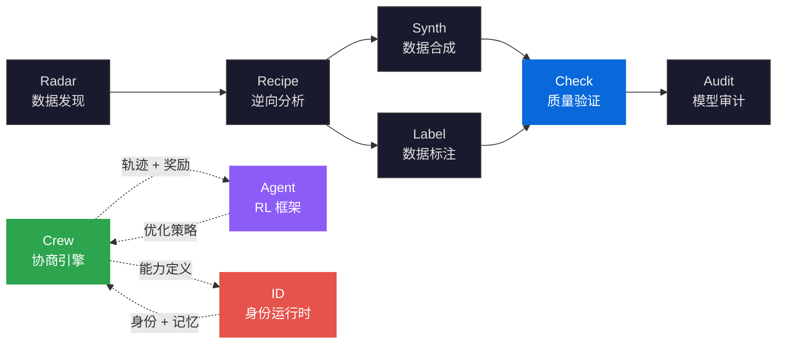

<div align="right">

[English](README.md) | **中文**

</div>

<div align="center">


<br/>

<h1>DataCheck</h1>

<h3>多维数据质量验证框架<br/>Multi-Dimensional Data Quality Validation</h3>

<p><strong>规则引擎 · 异常检测 · 分布分析 · 自动修复</strong><br/>
<em>面向 LLM 训练数据的自动化质量验证——可组合规则、IQR/Z-score 异常检测、自动修复管线</em></p>

[](https://pypi.org/project/knowlyr-datacheck/)
[](https://pypi.org/project/knowlyr-datacheck/)
[](https://www.python.org/downloads/)
[](LICENSE)
<br/>
[](https://github.com/liuxiaotong/data-check/actions/workflows/ci.yml)
[](#mcp-服务器)
[](#质量规则)
[](#快速开始)

[摘要](#摘要-abstract) · [问题陈述](#问题陈述-problem-statement) · [形式化框架](#形式化框架-formal-framework) · [架构](#架构-architecture) · [核心创新](#核心创新-key-innovations) · [快速开始](#快速开始-quick-start) · [质量规则](#质量规则-quality-rules) · [异常检测](#异常检测-anomaly-detection) · [MCP 服务器](#mcp-服务器-mcp-server) · [生态系统](#生态系统-ecosystem) · [参考文献](#参考文献-references)

</div>

---

## 摘要 / Abstract

训练数据质量是模型性能的隐性瓶颈——被忽略的格式错误、隐藏的 PII 泄露、未检测的重复样本，任何一个问题都可能在下游放大为系统性偏差。现有质检方案要么是一次性脚本（不可复用），要么是重量级平台（部署成本高），且普遍缺少**统计异常检测**和**自动修复**能力。

DataCheck 提出**可组合规则引擎** (composable rule engine) 驱动的数据质量验证框架：9 条内置规则覆盖完整性、有效性、隐私、一致性四个质量维度，**IQR / Z-score 双方法**自动检测数值和长度异常，**LLM 辅助评估**检查指令清晰度和回复相关性。系统实现「**验证 → 检测 → 分析 → 修复 → 报告**」的端到端管线，输出 Markdown / JSON / HTML 三种格式的结构化质量报告。

> **DataCheck** implements a composable rule engine for multi-dimensional data quality validation. The system provides 9 built-in rules (required fields, format, length bounds, PII detection, garbled text, near-duplicate detection via n-gram Jaccard, language consistency), IQR/Z-score statistical anomaly detection, LLM-assisted quality evaluation, auto-fix pipeline (dedup, strip whitespace, PII redaction), and report diff for tracking quality changes over time. Exposes 11 MCP tools for AI IDE integration.

---

## 问题陈述 / Problem Statement

LLM 训练数据的质量验证面临三个结构性问题：

| 根本性问题 | 形式化定义 | 现有方案局限 | DataCheck 的方法 |
|:---|:---|:---|:---|
| **验证碎片化**<br/>Validation Fragmentation | 质量检查散落在一次性脚本中，规则不可复用 $\implies$ 跨项目重复编写 | 每个团队自建质检脚本，无标准化规则引擎 | 9 条内置规则 + YAML 自定义规则 + 4 种预设规则集（default / sft / preference / llm） |
| **异常不可见**<br/>Anomaly Invisibility | 分布异常隐藏在大数据集中，人工审查无法覆盖 $\implies$ $\exists x \in D: \|x - \mu\| > k\sigma$ 未被发现 | 无统计异常检测，或依赖外部工具链 | IQR / Z-score 双方法自动检测数值和长度异常值，纯 Python 无依赖 |
| **反馈断裂**<br/>Feedback Disconnection | 质检结果与修复动作分离，修复后无法验证改进效果 | 检查和修复是独立流程，无报告对比 | 端到端管线：验证 → 修复 → 报告对比 (diff)，量化质量改进 |

> DataCheck 不是通用数据清洗工具。它专注于 **LLM 训练数据的质量门禁** (quality gate)——在数据进入训练管线前，确保其完整性、有效性、隐私合规性和分布合理性。

---

## 形式化框架 / Formal Framework

### 质量维度 / Quality Dimensions

数据质量定义为四维向量 $Q(D) = \langle Q_c, Q_u, Q_v, Q_a \rangle$：

| 维度 | 符号 | 度量 | 对应规则 |
|:---|:---|:---|:---|
| **完整性** Completeness | $Q_c$ | $1 - \lvert\{x: \exists f \in F_{\text{req}}, x.f = \emptyset\}\rvert / \lvert D\rvert$ | required_fields, non_empty |
| **唯一性** Uniqueness | $Q_u$ | $1 - \lvert\text{dup}(D)\rvert / \lvert D\rvert$ | duplicate, near_duplicate |
| **有效性** Validity | $Q_v$ | $1 - \lvert\{x: \neg \text{valid}(x)\}\rvert / \lvert D\rvert$ | format_valid, length_bounds, score_valid |
| **合规性** Compliance | $Q_a$ | $1 - \lvert\{x: \text{pii}(x) \lor \text{garbled}(x)\}\rvert / \lvert D\rvert$ | pii_detection, garbled_text |

### 综合质量分 / Composite Quality Score

综合质量分为各维度的加权和：

$$\text{Score}(D) = \frac{|\{x \in D : \text{pass}(x)\}|}{|D|} \times 100\%$$

| 通过率 | 评级 | 建议 |
|:---|:---|:---|
| $\geq 90\%$ | 优秀 (Excellent) | 可直接使用 |
| $\geq 70\%$ | 良好 (Good) | 建议修复警告 |
| $\geq 50\%$ | 一般 (Fair) | 需要处理错误 |
| $< 50\%$ | 较差 (Poor) | 严重质量问题 |

### 统计异常检测 / Statistical Anomaly Detection

**IQR 方法**（默认）：

$$\text{outlier}(x) \iff x < Q_1 - 1.5 \cdot \text{IQR} \;\lor\; x > Q_3 + 1.5 \cdot \text{IQR}$$

其中 $\text{IQR} = Q_3 - Q_1$（四分位距）。

**Z-score 方法**：

$$\text{outlier}(x) \iff \left|\frac{x - \mu}{\sigma}\right| > k, \quad k = 3$$

两种方法分别应用于数值字段（直接取值）和字符串字段（取长度），样本量 $\geq 10$ 时自动启用。

### 近似重复检测 / Near-Duplicate Detection

基于 n-gram Jaccard 相似度的近似重复检测：

$$J(A, B) = \frac{|G_n(A) \cap G_n(B)|}{|G_n(A) \cup G_n(B)|}$$

其中 $G_n(\cdot)$ 为 n-gram 集合。当 $J(A, B) > \theta$（默认 $\theta = 0.8$）时判定为近似重复。

---

## 架构 / Architecture


### 分层架构 / Layered Architecture

| 层 | 模块 | 职责 |
|:---|:---|:---|
| **规则层** Rules | `rules/` | 9 条内置规则 + YAML 自定义规则 + 4 种预设规则集 |
| **异常检测层** Anomaly | `anomaly.py` | IQR / Z-score 双方法，数值 + 长度异常检测 |
| **Schema 层** Schema | `schema.py` | 自动推断字段类型、约束、必填项 |
| **报告层** Report | `report.py` | Markdown / JSON / HTML 三格式报告生成 |
| **修复层** Fix | `fix.py` | 去重 · 去空白 · PII 脱敏自动修复 |
| **对比层** Diff | `diff.py` | 两次报告对比，量化质量变化 |
| **LLM 层** LLM | `llm/` | Anthropic / OpenAI 指令清晰度和回复相关性评估 |
| **监控层** Watch | `watch.py` | 文件变更自动重检，防抖机制 |
| **接口层** Interface | `cli.py` · `mcp_server.py` | CLI + MCP 11 工具 |

---

## 核心创新 / Key Innovations

### 1. 可组合规则引擎 / Composable Rule Engine

9 条内置规则覆盖四个质量维度，可通过 YAML 自定义规则扩展，无需写 Python 代码：

| 规则 | 级别 | 说明 |
|:---|:---|:---|
| `required_fields` | Error | 必填字段检查 |
| `non_empty` | Error | 关键字段非空检查 |
| `format_valid` | Error | 数据类型校验 |
| `score_valid` | Error | 评分范围有效性 |
| `length_bounds` | Warning | 文本长度边界 |
| `pii_detection` | Warning | 邮箱 / 手机号 / 身份证号检测 |
| `garbled_text` | Warning | 乱码 / 异常字符检测 |
| `repetitive_text` | Warning | 文本内过度重复检测 |
| `language_consistency` | Info | 多语言一致性（中/英/日/韩/俄/阿拉伯/泰） |

4 种预设规则集：`default`（通用）、`sft`（SFT 数据专用）、`preference`（偏好数据专用）、`llm`（LLM 质量评估）。

<details>
<summary>YAML 自定义规则</summary>

```yaml
# rules.yaml
rules:
  - field: instruction
    check: min_length
    value: 10
    severity: error

  - field: response
    check: max_length
    value: 10000
    severity: warning

  - field: category
    check: enum
    values: ["qa", "chat", "code", "math"]
    severity: error
```

```bash
knowlyr-datacheck check data.json --rules-file rules.yaml
```

</details>

### 2. 双方法统计异常检测 / Dual-Method Statistical Anomaly Detection

IQR 和 Z-score 双方法自动检测数值和长度异常值，纯 Python 实现无外部依赖。样本量 $\geq 10$ 时自动启用。

```bash
knowlyr-datacheck check data.json    # 自动包含异常检测
```

| 字段类型 | 检测内容 | 方法 |
|:---|:---|:---|
| 数值字段 | 极端值（如 score=999） | IQR / Z-score |
| 字符串字段 | 异常长/短文本 | IQR / Z-score（基于长度） |

### 3. 端到端质量管线 / End-to-End Quality Pipeline

验证 → 修复 → 对比，完整闭环：

```bash
# 1. 初次质检
knowlyr-datacheck check data.jsonl -o report_v1.json -f json

# 2. 自动修复（去重 + 去空白 + PII 脱敏）
knowlyr-datacheck fix data.jsonl -o fixed.jsonl --strip-pii

# 3. 再次质检
knowlyr-datacheck check fixed.jsonl -o report_v2.json -f json

# 4. 对比改进
knowlyr-datacheck diff report_v1.json report_v2.json
```

Watch 模式支持文件变更自动重检（防抖机制，默认 2 秒）：

```bash
knowlyr-datacheck watch ./data/ --debounce 3 --ruleset sft
```

### 4. LLM 辅助质量评估 / LLM-Assisted Quality Evaluation

使用 Anthropic / OpenAI 评估指令清晰度和回复相关性——超越规则检查的语义级质量评估：

```bash
knowlyr-datacheck check data.json --ruleset llm
knowlyr-datacheck check data.json --ruleset llm --llm-provider openai
```

### 5. Schema 推断与批量处理 / Schema Inference and Batch Processing

从数据文件自动推断 Schema（字段类型、约束、必填项），支持批量目录扫描：

```bash
# Schema 推断
knowlyr-datacheck infer data.jsonl -o schema.json

# 批量检查（递归扫描所有数据文件）
knowlyr-datacheck check ./data/ --pattern "*.jsonl" -o report.html -f html

# 采样检查（大数据集）
knowlyr-datacheck check data.jsonl --sample 1000
```

---

## 快速开始 / Quick Start

```bash
pip install knowlyr-datacheck
```

<details>
<summary>可选依赖</summary>

```bash
pip install knowlyr-datacheck[stats]    # 统计分析 (numpy, scipy)
pip install knowlyr-datacheck[mcp]      # MCP 服务器
pip install knowlyr-datacheck[llm]      # LLM 智能检查
pip install knowlyr-datacheck[yaml]     # YAML 规则配置
pip install knowlyr-datacheck[watch]    # Watch 模式
pip install knowlyr-datacheck[all]      # 全部功能
```

</details>

```bash
# 基础检查（支持 JSON / JSONL / CSV）
knowlyr-datacheck check data.json

# 指定 Schema + 输出报告
knowlyr-datacheck check data.json -s schema.json -o report.md

# HTML 报告
knowlyr-datacheck check data.json -o report.html -f html

# CI 集成：设定通过率阈值
knowlyr-datacheck check data.json --threshold 0.9 --strict

# 数据修复
knowlyr-datacheck fix data.jsonl -o fixed.jsonl --strip-pii
```

<details>
<summary>Python SDK</summary>

```python
from datacheck import DataChecker, QualityReport

checker = DataChecker()
result = checker.check_file("data.json", schema_path="schema.json")

report = QualityReport(result)
report.print_summary()
report.save("./report.md")
```

</details>

<details>
<summary>DataRecipe 集成</summary>

```bash
# 验证 DataRecipe 分析结果中的合成数据
knowlyr-datacheck validate ./analysis_output/my_dataset/
knowlyr-datacheck validate ./analysis_output/my_dataset/ -d custom_data.json
```

</details>

---

## 质量规则 / Quality Rules

<details>
<summary>规则详情</summary>

| 规则 ID | 级别 | 说明 |
|:---|:---|:---|
| `required_fields` | Error | 检查必填字段是否存在 |
| `non_empty` | Error | 检查关键字段是否为空 |
| `format_valid` | Error | 检查数据类型是否正确 |
| `score_valid` | Error | 检查评分范围有效性 |
| `length_bounds` | Warning | 文本长度范围检查 |
| `pii_detection` | Warning | 邮箱 / 手机号 / 身份证号 |
| `garbled_text` | Warning | 乱码 / 异常字符 |
| `repetitive_text` | Warning | 文本内过度重复 |
| `language_consistency` | Info | 多语言一致性 |

</details>

---

## 异常检测 / Anomaly Detection

IQR / Z-score 双方法，样本量 $\geq 10$ 时自动启用：

```python
from datacheck.anomaly import detect_anomalies

anomalies = detect_anomalies(samples)
for field, info in anomalies.items():
    print(f"{field}: {info['outlier_count']} outliers, range [{info['bounds']['lower']}, {info['bounds']['upper']}]")
```

---

## MCP 服务器 / MCP Server

```json
{
  "mcpServers": {
    "knowlyr-datacheck": {
      "command": "uv",
      "args": ["--directory", "/path/to/data-check", "run", "python", "-m", "datacheck.mcp_server"]
    }
  }
}
```

| 工具 | 说明 |
|:---|:---|
| `check_file` | 检查数据文件质量 |
| `check_directory` | 批量检查目录 |
| `validate_schema` | 验证 Schema 格式 |
| `infer_schema` | 从数据推断 Schema |
| `detect_anomalies` | 统计异常检测 |
| `fix_data` | 自动修复（去重/去空白/PII 脱敏） |
| `diff_reports` | 两次报告对比 |
| `list_rules` | 列出可用规则 |
| `validate_recipe` | 验证 DataRecipe 分析结果 |
| `export_report` | 导出质量报告 |
| `llm_check` | LLM 质量评估 |

---

## GitHub Actions

```yaml
- uses: actions/setup-python@v5
  with:
    python-version: '3.12'
- run: pip install knowlyr-datacheck
- run: knowlyr-datacheck check data.json --threshold 0.9 --strict
```

---

## CLI 参考 / CLI Reference

<details>
<summary>完整命令列表</summary>

| 命令 | 功能 |
|:---|:---|
| `knowlyr-datacheck check <file\|dir>` | 检查数据质量 |
| `knowlyr-datacheck check ... -s schema.json` | 指定 Schema |
| `knowlyr-datacheck check ... -o report.md` | 输出报告 |
| `knowlyr-datacheck check ... -f html\|json\|md` | 报告格式 |
| `knowlyr-datacheck check ... --sample 1000` | 采样检查 |
| `knowlyr-datacheck check ... --threshold 0.9` | 通过率阈值 |
| `knowlyr-datacheck check ... --ruleset sft\|preference\|llm` | 预设规则集 |
| `knowlyr-datacheck check ... --rules-file rules.yaml` | 自定义规则 |
| `knowlyr-datacheck infer <file> -o schema.json` | Schema 推断 |
| `knowlyr-datacheck fix <file> -o fixed.jsonl` | 自动修复 |
| `knowlyr-datacheck fix ... --strip-pii` | PII 脱敏 |
| `knowlyr-datacheck diff <v1> <v2>` | 报告对比 |
| `knowlyr-datacheck watch <file\|dir>` | Watch 模式 |
| `knowlyr-datacheck validate <dir>` | DataRecipe 结果验证 |
| `knowlyr-datacheck rules` | 列出所有规则 |

</details>

---

## 生态系统 / Ecosystem

<details>
<summary>架构图</summary>



</details>

| 层 | 项目 | 说明 | 仓库 |
|:---|:---|:---|:---|
| 发现 | **AI Dataset Radar** | 数据集竞争情报、趋势分析 | [GitHub](https://github.com/liuxiaotong/ai-dataset-radar) |
| 分析 | **DataRecipe** | 逆向分析、Schema 提取、成本估算 | [GitHub](https://github.com/liuxiaotong/data-recipe) |
| 生产 | **DataSynth** / **DataLabel** | LLM 批量合成 / 轻量标注 | [GitHub](https://github.com/liuxiaotong/data-synth) · [GitHub](https://github.com/liuxiaotong/data-label) |
| 质量 | **DataCheck** | 规则验证 · 异常检测 · 分布分析 · 自动修复 | 当前项目 |
| 审计 | **ModelAudit** | 蒸馏检测、模型指纹 | [GitHub](https://github.com/liuxiaotong/model-audit) |
| 身份 | **knowlyr-id** | 身份系统 + AI 员工运行时 | [GitHub](https://github.com/liuxiaotong/knowlyr-id) |
| 协商 | **Crew** | 对抗式多智能体协商 · 持久记忆进化 · MCP 原生 | [GitHub](https://github.com/liuxiaotong/knowlyr-crew) |
| 训练 | **knowlyr-gym** | Gymnasium 风格 RL 框架 · 过程奖励模型 · SFT/DPO/GRPO | [GitHub](https://github.com/liuxiaotong/knowlyr-gym) |

---

## 开发 / Development

```bash
git clone https://github.com/liuxiaotong/data-check.git
cd data-check
pip install -e ".[all,dev]"
pytest
```

**CI**：GitHub Actions，Python 3.10+。Tag push 自动发布 PyPI + GitHub Release。

---

## 参考文献 / References

- **Data Quality Dimensions** — Wang, R.Y. & Strong, D.M., 1996. *Beyond Accuracy: What Data Quality Means to Data Consumers.* Journal of Management Information Systems — 数据质量的经典四维模型
- **Confident Learning** — Northcutt, C. et al., 2021. *Confident Learning: Estimating Uncertainty in Dataset Labels.* JAIR — 标签噪声检测
- **Anomaly Detection** — Hodge, V. & Austin, J., 2004. *A Survey of Outlier Detection Methodologies.* Artificial Intelligence Review — 异常检测方法综述
- **Near-Duplicate Detection** — Broder, A., 1997. *On the Resemblance and Containment of Documents.* SEQUENCES — n-gram Jaccard 近似重复检测
- **Data Cleaning** — Rahm, E. & Do, H.H., 2000. *Data Cleaning: Problems and Current Approaches.* IEEE Data Engineering Bulletin — 数据清洗问题与方法

---

## 许可证 / License

[MIT](LICENSE)

---

<div align="center">
<sub><a href="https://github.com/liuxiaotong">knowlyr</a> — 多维数据质量验证框架，统计异常检测</sub>
</div>
